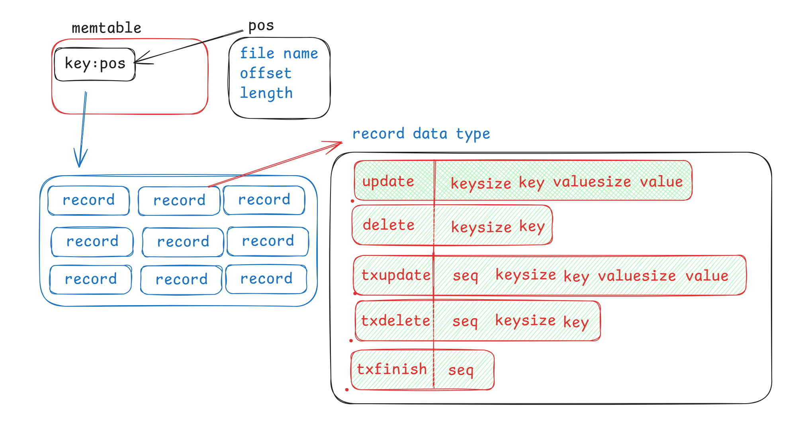

# bitcask_go Database
[中文版](./readme_zh.md)

bitcask_go is a simple database system based on the Bitcask storage engine, implemented in Go. This project builds upon a fully implemented Bitcask engine and adds basic SQL parsing functionality.

## Features

- Fully implemented Bitcask storage engine, providing efficient key-value storage
- Support for basic SQL operations:
  - CREATE TABLE: Create new tables
  - INSERT: Insert data
  - SELECT: Query data (with simple WHERE conditions)
  - DELETE: Delete data
- Persistent data storage
- Simple in-memory indexing to accelerate query operations

## Implementation Details

- Utilizes an efficient Bitcask storage engine as the underlying layer
- Implements a basic SQL parser, supporting simple SQL operations
- Supports fundamental data types: INT, STRING, FLOAT, BOOL

## Usage

Please refer to the example code in the `db_test.go` file to understand how to use the bitcask_go database. The basic workflow is as follows:

1. Create a database instance
2. Execute CREATE TABLE statements to create tables
3. Use INSERT statements to insert data
4. Query data using SELECT statements
5. Delete data using DELETE statements

## Limitations

- SQL parsing functionality is still under development, with limited operations currently supported
- Only single table operations are supported; table joins are not implemented
- WHERE clause support is limited, only simple comparison operations are available
- No support for transactions or concurrency control

## Note

While the underlying Bitcask engine is fully implemented, the SQL functionality built on top of it is still in an experimental stage. Please evaluate carefully before using in a production environment.

## Future Plans

- Enhance the SQL parser to support more complex query operations
- Add advanced indexing support
- Implement basic transaction support

Contributions and suggestions are welcome!