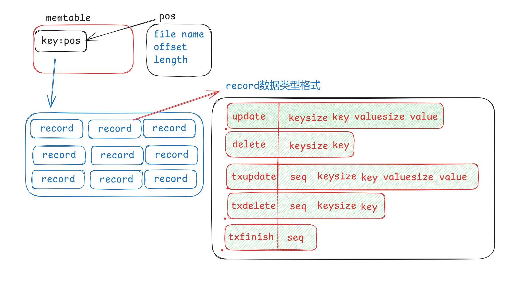

# bitcask_go 数据库

bitcask_go 是一个基于 Bitcask 存储引擎的简单数据库系统，使用 Go 语言实现。这个项目在完全实现的 Bitcask 基础上，添加了基本的 SQL 解析功能。

## 功能特性

- 完整实现的 Bitcask 存储引擎，提供高效的键值存储
- 支持基本的 SQL 操作：
  - CREATE TABLE：创建新表
  - INSERT：插入数据
  - SELECT：查询数据（支持简单的 WHERE 条件）
  - DELETE：删除数据
- 数据持久化存储
- 简单的内存索引，加速查询操作

## 实现细节

- 底层使用高效的 Bitcask 存储引擎
- 实现了基本的 SQL 解析器，支持简单的 SQL 操作
- 支持基本的数据类型：INT、STRING、FLOAT、BOOL

## 使用方法

请参考 `db_test.go` 文件中的示例代码来了解如何使用 bitcask_go 数据库。基本使用流程如下：

1. 创建数据库实例
2. 执行 CREATE TABLE 语句创建表
3. 使用 INSERT 语句插入数据
4. 通过 SELECT 语句查询数据
5. 使用 DELETE 语句删除数据

## 局限性

- SQL 解析功能仍在开发中，目前支持的操作有限
- 仅支持单表操作，不支持表连接
- WHERE 子句支持有限，仅支持简单的比较操作
- 不支持事务和并发控制

## 注意事项

虽然底层的 Bitcask 引擎已经完全实现，但基于其上的 SQL 功能仍处于实验阶段。在生产环境中使用时请谨慎评估。

## 未来计划

- 完善 SQL 解析器，支持更多复杂的查询操作
- 添加更高级的索引支持
- 实现简单的事务支持

欢迎贡献代码或提出建议！